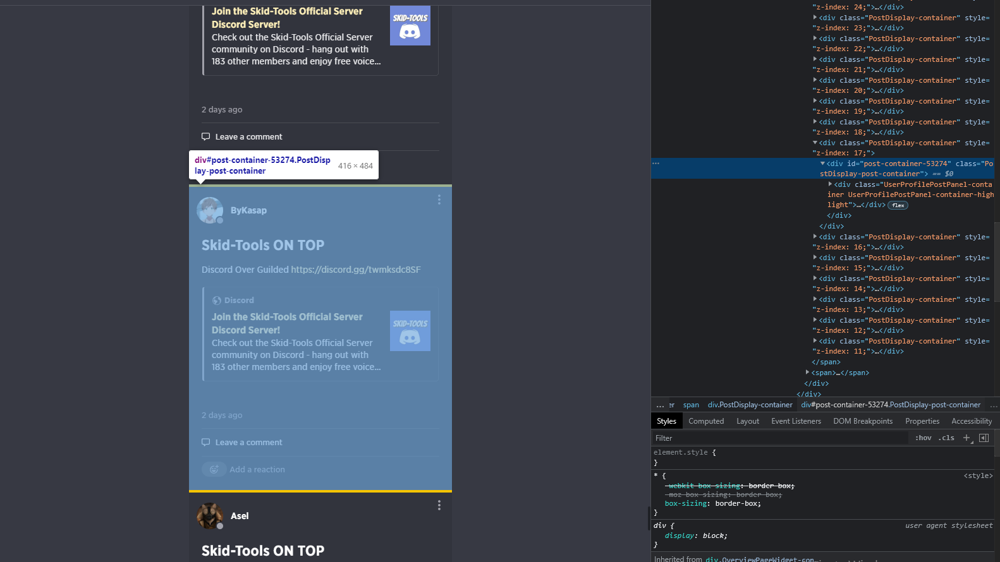

# GUILDED Mass Profile Post Remover 
Trusted in humanity? Let everyone post on your profile? Got botted by a rando emo 13y/o who probably doesn't even know whose github code they are using or even what they are doing with their life!? 
Well fear not my friend! Your ill-judgement/ignorance from past should not affect your today! 'Cuz in 5 easy steps you can clean up your Guilded profile!

## > How to use!
- Clone the repo
- Make sure you have node.js installed
- CD into it and run `npm i` or `yarn install` depending on which one you use
- Check the 69 liner source code's perfection again and rejoice that this is not malicious code and you got it for free
- Run `npm run dev` or `yarn dev` and follow the prompts

## > FAQ 
> This part is still a stub cuz i really don't know what people will ask in a program this simple so contributions to this will be appreciated!

### > How to get post ID
- If you are on browser use your browser's inspector window, you can use command+option+i on mac client and ctrl+shift+i on pc client, guilded makes the post id pretty clear, like literally it's just there... just copy the number and nothing else, like in this ss it would be 53274, just enter the top most post id that you wanna delete, scroll down, enter the first spam post's id and boom if everything goes correctly, congrats! you have cleared your profile! 